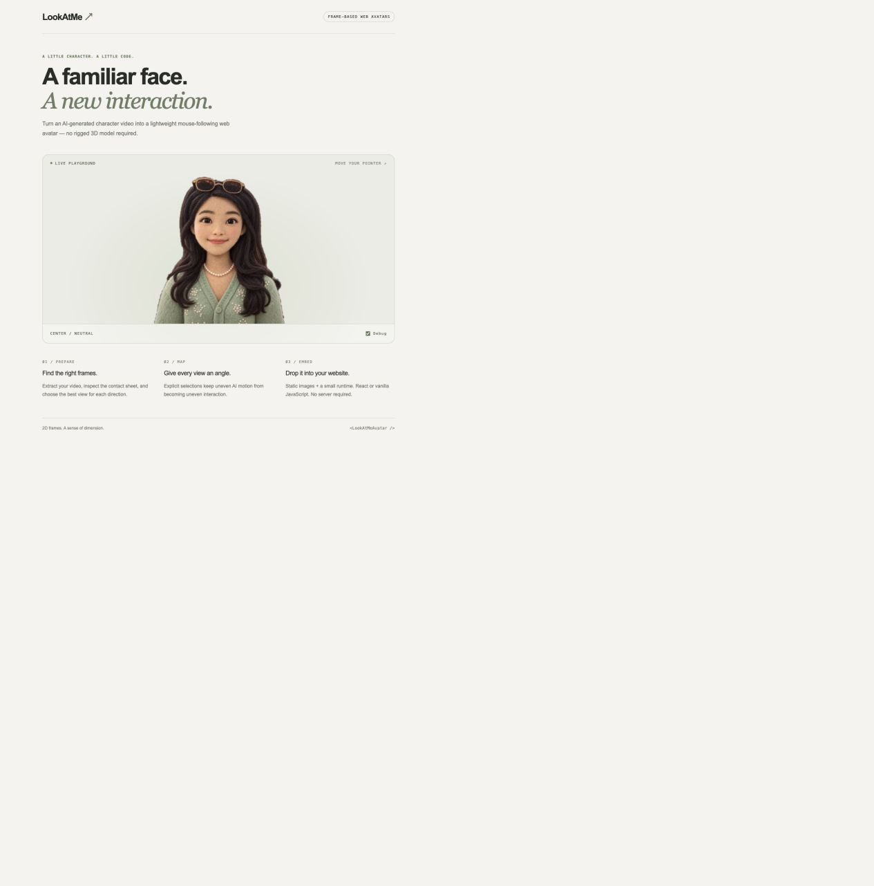
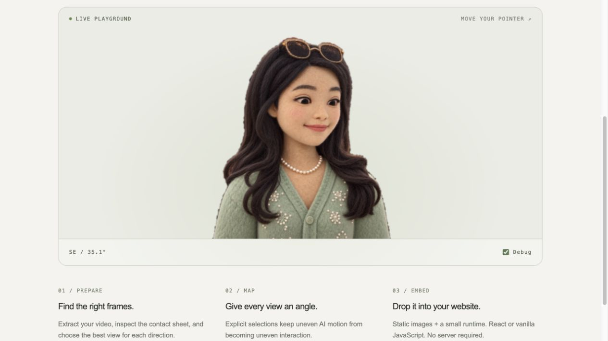

# LookAtMe

### Turn an AI Character Video into a Mouse-Following Web Avatar

Turn an AI-generated character video into a lightweight mouse-following web avatar — no rigged 3D model required.

LookAtMe is a small, reusable **pseudo-3D, 2D frame-based interaction**. It selects a still image that faces the pointer. It is not a rigged 3D model, a video player, or a portfolio generator.

## LookAtMe v2 architecture

v2 separates frame production from pointer rendering. The renderer has no video, AI-provider, filename, dimension, or character-specific assumptions:

```text
Video → VideoFrameProducer ─┐
                            ├→ AvatarFrameSet → DirectionalAvatarRenderer
Photo → PhotoAIFrameProducer ─┘
Manual/static images ────────→ AvatarFrameSet → DirectionalAvatarRenderer
```

The stable renderer-facing contract preserves arbitrary and uneven direction angles:

```ts
interface AvatarFrameSet {
  version: 2;
  center: { key: string; src: string; frame?: number };
  directions: Array<{ key: string; src: string; angle: number; frame?: number }>;
  metadata?: {
    width?: number;
    height?: number;
    aspectRatio?: number;
    source?: { type: 'video' | 'photo' | 'manual' | string };
  };
}
```

`center` and at least one direction are required. Additional directions are optional: nearest-angle selection is the predictable fallback when diagonals or other poses are absent. Sources can be relative image paths, absolute URLs, or browser-supported data/blob URLs. Metadata belongs to producers and is ignored by the renderer.

The video tools, manual adapter, and server-side `PhotoAIFrameProducer` are independent producers. Photo generation creates a canonical styled center from the portrait first, then uses that center as the identity reference for left, right, up, and down. All three paths finish as the same `AvatarFrameSet`.

```text
Character Image
      ↓
AI Rotation Video             Bring your own video
      ↓
Frame Extraction              FFmpeg: every decoded frame
      ↓
Contact Sheet                 Numbered visual candidates
      ↓
Directional Frame Selection   Human-inspected representative views
      ↓
Angle Map                     Explicit angles → filenames
      ↓
Mouse-Following Web Avatar     Static images + JavaScript
```

[**Try the live demo →**](https://lingyun1010.github.io/lookatme/)

## Demo screenshots

The standalone playground with the sample character:



Move the pointer to switch to an inspected directional frame. The debug readout shows the selected direction and pointer angle:



## No-code setup with an AI skill / 零基础使用

Use an AI coding assistant that supports installable skills, local terminal execution, uploaded files and visual image inspection (such as Codex). The assistant runs the tools for you. A browser-o[...]

**1. Install once.** Paste this into Codex:

> Install the LookAtMe skill from https://github.com/lingyun1010/lookatme/tree/main/skills/lookatme-avatar using the skill installer.

中文安装提示词：

> 请安装这个 Skill：https://github.com/lingyun1010/lookatme/tree/main/skills/lookatme-avatar

The skill is available on the next turn after installation. If your assistant does not refresh skills automatically, start a new task/session.

**2. Upload your character video, then say:**

> Use $lookatme-avatar to turn my uploaded video into a mouse-following avatar. Inspect the frames and choose representative directions, generate the assets, start a local preview, and open it for[...]

中文使用提示词：

> 使用 $lookatme-avatar，根据我上传的视频生成 LookAtMe avatar。请检查视频帧并选择合适的方向，生成素材，启动本地预览网页并帮我打开。只在本地生��[...]

The skill sets up an isolated project, installs project dependencies, extracts frames, asks the assistant to visually select poses, and serves the generated page on an available localhost port. No[...]

**Selection is AI-assisted, not automatic pose estimation.** It must inspect this video's images, never divide its timeline into equal angles. If the assistant cannot inspect images, it asks you t[...]

The result contains reusable `frames/`, canonical `avatar-frame-set.json`, backward-compatible `angle-map.json`, `contact-sheet.jpg`, `lookatme.js` and `preview.html`. The local server must remain running; the assistant provides its URL and restart command. The [public demo](https://lingyun1010.github.io/lookatme/) is a sample, not an upload service.

## Try the included character

Requires Node.js 22.12+ and npm.

```bash
npm install
npm run dev
```

Open the local URL printed by Vite. Move the cursor around the portrait; its middle is a neutral dead zone. The debug checkbox shows the chosen frame and cursor angle. On touch devices, moving a t[...]

```bash
npm test
npm run build
npm run preview
# Optional processing-tool tests, after installing Python requirements:
.venv/bin/python -m unittest discover -s tests -p 'test_*.py'
```

`dist/` is the standalone demo. `lib/` contains the reusable React library, types, and a bundled vanilla module. No Python, FFmpeg, AI service, API key, or server is needed at runtime.

## Photo AI demo

Photo generation is server-only. Copy the environment template and provide an API key—the key is read by Vite's local server middleware and is never included in browser code:

```bash
cp .env.example .env
# Edit .env and set OPENAI_API_KEY
npm run dev
```

Open the printed localhost URL and use the **Photo AI** section. The server validates and normalizes PNG, JPEG, or WebP portraits, generates five 1024×1024 PNG frames, stores them under ignored `.lookatme/generated/`, and returns their local URLs in an `AvatarFrameSet`.

The OpenAI adapter uses the Image API's edit endpoint with `gpt-image-2`, medium quality, high input fidelity, and PNG output. The library's provider boundary is independent of OpenAI:

```ts
import {
  LocalAvatarImageStorage,
  OpenAIImageGenerationProvider,
  PhotoAIFrameProducer,
  SharpGeneratedImageValidator
} from 'lookatme-avatar/server';

const producer = new PhotoAIFrameProducer({
  provider: new OpenAIImageGenerationProvider(),
  storage: new LocalAvatarImageStorage('.lookatme/generated'),
  validator: new SharpGeneratedImageValidator()
});

const frames = await producer.produce({
  image: uploadedBytes,
  mimeType: 'image/jpeg',
  style: 'felt@1'
});
```

Styles are versioned (`felt@1`, `cartoon@1`, `cinematic-3d@1`, and `anime@1`). A partial directional failure reports the frame-set ID and completed directions; `regenerateDirection()` can replace only the failed frame.

## Prepare your own video

Install FFmpeg (including `ffprobe`) and Python 3.10+. Then, from the repository root:

```bash
python3 -m venv .venv
source .venv/bin/activate
pip install -r tools/requirements.txt
npm run build:lib
python tools/extract_frames.py character-video.mp4 --output work
python tools/make_contact_sheet.py work/frames --output work/contact-sheet.jpg
```

Extraction saves `work/video-info.json` containing video stream metadata, and `work/frames/000001.png`, etc. Frame numbers are **1-based decoded visual frame order**, not encoded I-frame indices. [...]

Inspect the sheets and write `selection.json`:

```json
{
  "center": { "frame": 121 },
  "directions": [
    { "key": "e", "angle": 0, "frame": 44 },
    { "key": "s", "angle": 90, "frame": 61 },
    { "key": "w", "angle": 180, "frame": 78 },
    { "key": "n", "angle": 270, "frame": 106 }
  ]
}
```

These example indices belong to the original sample video only. Choose your own indices for your video. `example/selection.json` preserves all 16 inspected sample directions.

**Never assume equal time intervals mean equal rotation angles.** AI videos may repeat poses, distort faces, or rotate inconsistently. Choose representative images visually. Four directions work;[...]

```bash
python tools/build_angle_map.py --frames work/frames --selection selection.json --output output --max-size 768
python -m http.server 8080 --directory output
```

Open [the generated preview](http://localhost:8080/preview.html). Serve over HTTP; browsers may block JSON/modules when opened with `file://`.

```text
output/
├── frames/              Optimised PNGs; alpha preserved; no upscaling
│   ├── center.png
│   ├── e.png
│   └── ...
├── angle-map.json
├── avatar-frame-set.json Canonical v2 contract with video provenance
├── contact-sheet.jpg    Selected views, labelled with source indices
├── preview.html
└── lookatme.js          Standalone vanilla runtime for the preview
```

The builder validates keys, source files, identical image dimensions, unique angles and positive frame indices. A frame may deliberately serve multiple directions. Existing nonempty output folder[...]

To run the main demo with your assets, replace `example/frames/` and `example/angle-map.json` with the generated versions, then restart `npm run dev`.

## React integration

The runtime is published to npm as `lookatme-avatar`. Install the React/vanilla runtime with:

```bash
npm install lookatme-avatar
```

The npm package contains the runtime and Skill; video preparation uses the Skill workflow above. You can also copy `src/core/`, `src/component/`, and `src/index.ts` into your project's `src/looka[...]

```bash
# Inside LookAtMe
npm run build
npm pack
# Inside the consuming React application
npm install /absolute/path/to/lookatme/lookatme-avatar-0.1.0.tgz
```

Copy the generated `frames/` and `angle-map.json` into your application's `public/avatar/` directory.

```tsx
import { LookAtMeAvatar } from 'lookatme-avatar';
// If copying source: import { LookAtMeAvatar } from './lookatme';

export function Character() {
  return (
    <LookAtMeAvatar
      frameBasePath="./avatar/frames"
      frames="./avatar/avatar-frame-set.json"
      size={600}
      deadZone={0.12}
    />
  );
}
```

For a Vite site deployed under `/my-site/`, use its deployment base explicitly:

```tsx
const base = import.meta.env.BASE_URL;
<LookAtMeAvatar
  frameBasePath={`${base}avatar/frames`}
  angleMap={`${base}avatar/angle-map.json`}
  width="100%"
  height={480}
  objectFit="contain"
  tracking="avatar"
/>
```

A leading `/avatar` always refers to the domain root; it will not automatically include a GitHub Pages repository path. Relative URLs resolve against `document.baseURI`, so nested router routes s[...]

| Prop | Default | Meaning |
| --- | --- | --- |
| `frames` | required | `AvatarFrameSet`, legacy v1 map, or JSON URL |
| `frameBasePath` | `.` | Base directory for relative frame sources |
| `angleMap` | unset | Deprecated v1 alias for `frames` |
| `size` | `600` | Width in pixels or CSS length; square when height omitted |
| `width`, `height` | unset | Override dimensions; width is capped at 100% of parent |
| `objectFit` | `contain` | Image fitting mode |
| `deadZone` | `0.12` | Radius / shorter tracking dimension, range 0–1 |
| `tracking` | `avatar` | `avatar` midpoint or `viewport` midpoint |
| `alt` | Character following the pointer | Accessible image description |
| `onFrameChange` | unset | Debug callback `{ angle, key, isCenter }`, at most once per animation frame |
| `onError` | unset | Load/validation error callback; React also displays an error |

The component never intercepts pointer events. Without pointer movement it stays neutral. It resets on pointer exit or window blur. Unmounting removes observers/listeners; prop changes reload the[...]

## Vanilla JavaScript integration

Copy `lib/vanilla.js` into your website alongside your generated assets. It has no React dependency and no external imports.

```html
<div id="lookatme-avatar"></div>
<script type="module">
  import { createLookAtMeAvatar } from './vanilla.js';
  const avatar = createLookAtMeAvatar({
    container: '#lookatme-avatar',
    frameBasePath: './avatar/frames',
    frames: './avatar/avatar-frame-set.json',
    size: 600,
    deadZone: 0.12
  });
  await avatar.ready; // catch errors in your application's UI
  // On page teardown: avatar.destroy();
</script>
```

Bundler consumers can import from `lookatme-avatar/vanilla`. Options match React. `element` accepts a selector or HTMLElement; only the owned avatar child is removed on teardown.

`container` is the v2 mount option; the original `element` name remains supported. Both adapters call the same engine:

```ts
import { mountDirectionalAvatar } from 'lookatme-avatar';

const avatar = mountDirectionalAvatar({ container, frames, deadZone: 0.12 });
await avatar.ready;
avatar.destroy(); // listeners, RAF work, observer, fetch, and owned DOM are cleaned up
```

### v1 migration and compatibility

Existing `angleMap` + `frameBasePath` React usage and `element` + `angleMap` vanilla usage continue to work. v1 maps are normalized to v2 at the renderer boundary. New code should rename `angleMap` to `frames`, use `container` in vanilla JavaScript, and prefer the generated `avatar-frame-set.json`. No frame assets or direction angles need to change.

## Angle map and architecture

```json
{
  "version": 1,
  "center": { "key": "center", "src": "center.png", "frame": 121 },
  "directions": [
    { "key": "e", "angle": 0, "src": "e.png", "frame": 44 },
    { "key": "n", "angle": 270, "src": "n.png", "frame": 106 }
  ]
}
```

<<<<<<< HEAD
Angles use screen coordinates: **east 0°, south 90°, west 180°, north 270°**. The runtime picks the smallest circular angular distance. Equal distances prefer the first configured entry. `fra[...]
=======
Angles use screen coordinates: **east 0°, south 90°, west 180°, north 270°**. The runtime picks the smallest circular angular distance. Equal distances prefer the first configured entry. `frame` is provenance only. Relative sources are joined to `frameBasePath`; absolute and browser-supported image URLs pass through unchanged. Keys and angles must be unique.
>>>>>>> 390f783 (Generate directionl frames by OpenAI)

- `tools/`: video inspection/extraction, paginated contact sheets, explicit selections → optimised static output.
- `example/`: reusable sample assets and mappings; Vite serves this as its public asset directory.
- `src/core/`: pure geometry, map validation, decoding, shared pointer/render lifecycle.
- `src/producers/video/`: adapts the existing video pipeline output to `AvatarFrameSet`.
- `src/producers/photo/`: provider-independent photo contracts, styles, prompts, and direction mapping.
- `src/server/photo/`: Sharp preprocessing/validation, local storage, OpenAI adapter, orchestration, and local demo middleware.
- `src/producers/manual.ts`: validation adapter for supplied/static frame sets.
- `src/component/`: typed React adapter. Pointer lifecycle stays in the shared runtime instead of a React-specific hook.
- `src/vanilla.ts`: framework-free adapter; builds to a single ES module.
- `src/demo/`: neutral playground, isolated from library code.
- `docs/extraction.md`: reference implementation findings and removed portfolio coupling.

All frames are decoded before interaction starts and retained in the DOM. Visibility changes occur in one animation frame, with no opacity fades or brightness blending. Startup waits for the full[...]

## GitHub Pages

The demo uses relative deployment paths. `.github/workflows/pages.yml` tests, builds and deploys `dist/` on pushes to `main`.

1. Create a GitHub repository named `lookatme` and push this standalone repository to it.
2. In **Settings → Pages → Build and deployment**, select **GitHub Actions**.
3. Run the workflow or push to `main`. The deployment job reports the live URL.

The official demo is live at https://lingyun1010.github.io/lookatme/. For your own fork, enable Pages and push to its remote as described above. To test a sub-path locally, serve the parent of a [...]

## Attribution and licence

New LookAtMe code is MIT licensed; see `LICENSE`. Sample character assets and the selected-frame contact sheet were supplied by Lingyun Zhao's [reference portfolio](https://github.com/lingyun1010[...]

No authentication, database, payments, production CDN, job queue, advanced identity scoring, or automatic pose estimation are included.
